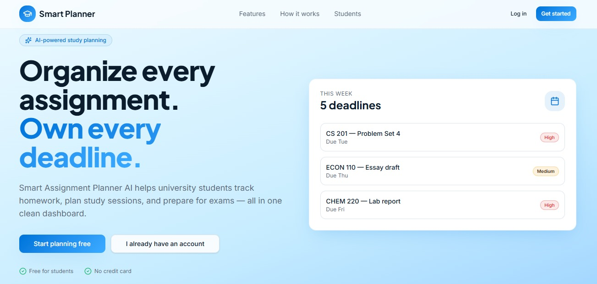
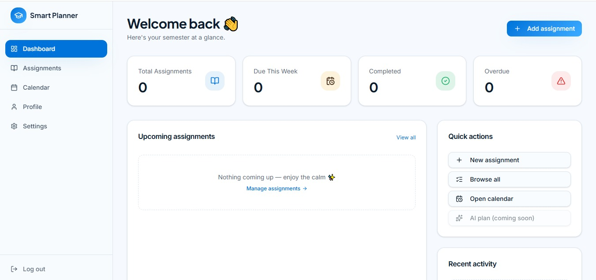
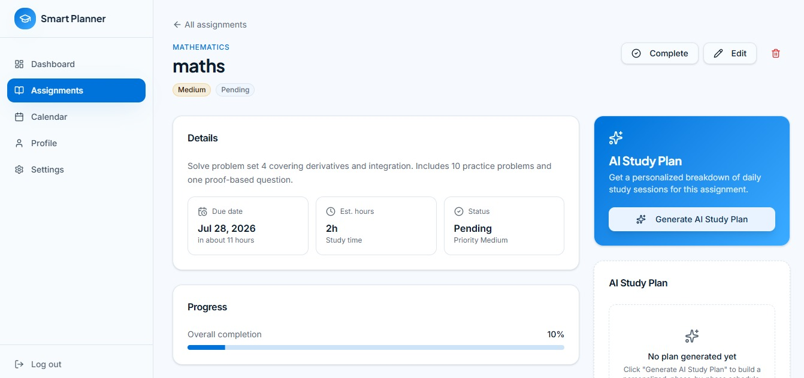

# 📚 Smart Assignment Planner AI

An AI-powered web application that helps university students organize assignments, manage deadlines, and generate personalized study plans using Google Gemini AI.

---

# 📖 Project Overview

Smart Assignment Planner AI is an AI-powered web application designed to help university students organize assignments, manage deadlines, and improve their study planning. The application enables users to create and manage assignments while generating personalized AI-powered study plans that break large assignments into manageable daily tasks.

With secure user authentication, assignment tracking, and intelligent scheduling, the platform helps students stay organized, reduce procrastination, and complete their work before deadlines.

---

# 🎯 Problem Statement

University students often struggle with managing multiple assignments, remembering deadlines, and creating effective study schedules. Many students postpone their work until the last minute because they lack a structured plan for completing assignments.

Smart Assignment Planner AI addresses these challenges by combining assignment management with Artificial Intelligence. The application generates personalized study plans based on assignment details, helping students organize their workload and complete tasks in a balanced and efficient manner.

## 👥 Target Users

- University Students
- College Students
- Online Learners
- Anyone managing multiple assignments or study tasks

---

# 🌐 Live Application

**Live Demo:**  
https://smart-study-planner-ai-one.vercel.app/

---

# ✨ Features

## 🔐 User Authentication
- User Registration
- Secure Login
- Logout
- Protected Dashboard
- User Profile Management

## 📝 Assignment Management
- Add New Assignment
- Edit Assignment
- Delete Assignment
- View Assignment Details
- Mark Assignments as Completed
- Progress Tracking

## 📊 Dashboard
- Total Assignments
- Due This Week
- Completed Assignments
- Overdue Assignments
- Upcoming Assignments
- Recent Activity
- Quick Action Panel

## 📂 Assignment Organization
- Search Assignments
- Filter by Status
- Filter by Priority
- Sort by Due Date
- Card View
- Table View

## 🤖 AI Features
- AI Study Plan Generation
- Personalized Daily Study Schedule
- Phase-by-Phase Learning Plan
- Resource Recommendations
- Productivity Tips
- Regenerate Study Plan
- Interactive Checklist for Completed Study Steps

## 📱 Responsive Design
- Desktop Friendly
- Tablet Friendly
- Mobile Responsive
- Modern User Interface
- Loading States
- Empty States

---

# 🧠 AI Feature

The application integrates **Google Gemini AI** to generate personalized study plans based on the student's assignment details.

When the user clicks **Generate AI Study Plan**, the application sends the following information to Gemini AI:

- Assignment Title
- Course
- Assignment Description
- Due Date
- Estimated Study Hours
- Priority

Based on this information, Gemini AI generates:

- A structured day-by-day study schedule
- Phase-by-phase learning plan
- Daily learning objectives
- Resource recommendations
- Productivity tips
- Balanced workload distribution

The generated study plan is displayed on the Assignment Details page and is saved for future reference.

---

# 💡 AI System Prompt

> **"You are an expert academic tutor. Analyze the student's assignment details and generate a realistic, structured, phase-by-phase daily preparation schedule. Include key focus areas, resource recommendations, and one high-impact productivity tip."**

---

# 🛠️ Technologies Used

## Frontend
- React
- TypeScript
- Tailwind CSS
- shadcn/ui
- React Router

## Backend
- **Supabase** – Backend platform and PostgreSQL database for storing application data.
- **Supabase Authentication** – Authentication service used for secure user registration, login, and session management.
- PostgreSQL Database

## Artificial Intelligence
- Google Gemini API

## Development Platform
- **Built with Lovable AI** – Used to scaffold and develop the application's frontend, backend integration, and overall project structure.

## Deployment
- Vercel

## Version Control
- GitHub

---

# 📸 Screenshots

## 🏠 Landing Page



## 📊 Dashboard



## ➕ Add Assignment



---

# 🚀 How to Run the Project

1. Clone or download this repository to your computer.
2. Open the project folder in Visual Studio Code or any code editor.
3. Install all required dependencies:

```bash
npm install
```

4. Create a `.env` file and add:

```env
VITE_SUPABASE_URL=your_supabase_project_url
VITE_SUPABASE_ANON_KEY=your_supabase_anon_key
GEMINI_API_KEY=your_gemini_api_key
```

5. Start the development server:

```bash
npm run dev
```

6. Open the local URL displayed in the terminal (usually `http://localhost:5173`) in your web browser.
7. Register a new account or log in to start managing assignments and generating AI-powered study plans.

---

# ▶️ How to Use the Application

1. Register a new account using your email address and password.
2. Log in with your registered credentials.
3. After logging in, you will be redirected to the dashboard.
4. Click **Add Assignment** and enter the assignment details.
5. Save the assignment to store it in your personal dashboard.
6. Open any assignment and click **Generate AI Study Plan** to receive a personalized study schedule powered by Google Gemini AI.
7. Track your assignments, edit or delete them, update their progress, and mark study tasks as completed.

---

# 📂 Project Structure

```text
src/
├── components/
├── pages/
├── integrations/
├── hooks/
├── lib/
├── App.tsx
└── main.tsx
```
